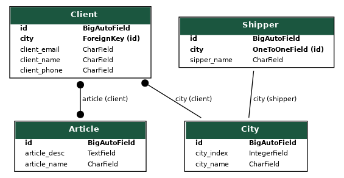

# <h1>Django_hw_1</h1>
<h2>Here is some django project.</h2><br>
Here list what was done:

* new management commands was created:
  * command to create users<br>
    use $ python manage.py create_users 1 (numbers of users in range 1-10)
  * command to delete users<br>
    use $ python manage.py delete_users 1 2 3 4 5 (any numbers of users id can be specified, command with superuser ide dos not work)
* new models for testing was created (City, Article, Shipper and Client)
* all fixtures in project
* additional views that can be used:
  * /catalog/triangle/  -  to calkulate hypotenuse in triangle

<h3>Here is models diagram:




Here is my request in $ ./manage.py shell_plus --print-sql
* Client - City (OTM)
```python
city = City.objects.get(id=3)
```
```sql
SELECT "catalog_city"."id",
       "catalog_city"."city_name",
       "catalog_city"."city_index"
  FROM "catalog_city"
 WHERE "catalog_city"."id" = 3
```
```python
city.client_set.all().order_by('client_name')
```
```sql
SELECT "catalog_client"."id",
       "catalog_client"."client_name",
       "catalog_client"."client_email",
       "catalog_client"."client_phone",
       "catalog_client"."city_id"
  FROM "catalog_client"
 WHERE "catalog_client"."city_id" = 3
 ORDER BY "catalog_client"."client_name" ASC
```
* City - Shipper (OTO)
```python
Shipper.objects.get(city__pk=1)
```
```sql
SELECT "catalog_shipper"."id",
       "catalog_shipper"."sipper_name",
       "catalog_shipper"."city_id"
  FROM "catalog_shipper"
 WHERE "catalog_shipper"."city_id" = 1
```
```python
city = City.objects.get(city_name__contains='i')
```
```sql
SELECT "catalog_city"."id",
       "catalog_city"."city_name",
       "catalog_city"."city_index"
  FROM "catalog_city"
 WHERE "catalog_city"."city_name" LIKE '%a%' ESCAPE '\'
```
```python
city.filter(shipper=1)
```
```sql
SELECT "catalog_city"."id",
       "catalog_city"."city_name",
       "catalog_city"."city_index"
  FROM "catalog_city"
 INNER JOIN "catalog_shipper"
    ON ("catalog_city"."id" = "catalog_shipper"."city_id")
 WHERE ("catalog_city"."city_name" LIKE '%i%' ESCAPE '\' AND "catalog_shipper"."id" = 1)
```
* Client - Article (MTM)
```python
Article.objects.prefetch_related('client_set').all().order_by('-client')
```
```sql
SELECT "catalog_article"."id",
       "catalog_article"."article_name",
       "catalog_article"."article_desc"
  FROM "catalog_article"
  LEFT OUTER JOIN "catalog_client_article"
    ON ("catalog_article"."id" = "catalog_client_article"."article_id")
 ORDER BY "catalog_client_article"."client_id" DESC


SELECT ("catalog_client_article"."article_id") AS "_prefetch_related_val_article_id",
       "catalog_client"."id",
       "catalog_client"."client_name",
       "catalog_client"."client_email",
       "catalog_client"."client_phone",
       "catalog_client"."city_id"
  FROM "catalog_client"
 INNER JOIN "catalog_client_article"
    ON ("catalog_client"."id" = "catalog_client_article"."client_id")
 WHERE "catalog_client_article"."article_id" IN (4, 2, 1, 3)

```
